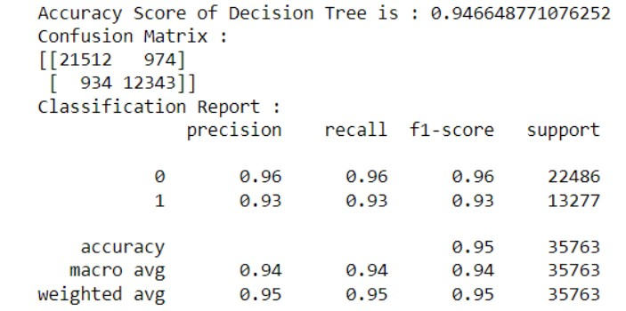

# Portfolio

#### Technical Skills: Python, SQL, MATLAB, Tableau, JavaScript

## Education
Universitas Airlangga (_2019 - 2023_)
- Bachelor of Computers; Current GPA: 3.53/4.0 
- Thesis : The Application of Machine Learning to Predict Hotel Customer Loyalty Using the Decision Tree and Random Forest Methods (Case Study: Hotel Nugraha Homestay Surabaya).
- English Language Proficiency Test Score: 633.

## Professional Experience
**PT. Telkom Indonesia,Tbk (Persero) (_Dec 2021 - Feb 2022_)**

_IT Data Management Internship_
- Data Entry uses software made by Telkom Indonesia, and inputs customer data with the help of 
 SQL-based and Oracle software.
- Data Management for customers related to service products from Telkom Indonesia. Data management is carried out by classifying customer data based on Telkom Indonesia product and service categories.
- Identify Data by comparing the data entered with the data stored in Telkom Indonesia's software

## Projects
### Predicting Hotel Customer Loyalty using Machine Learning Based Decision Tree

The purpose of this research is to create a predictive model for hotel customer loyalty using the Decision Tree methods. Additionally, this study aims to obtain a comparative analysis of the accuracy percentages of the Decision Tree and Random Forest methods in predicting hotel customer loyalty. The dataset that used are obtained from Kaggle Website.

Classification uses the Decision Tree  methods, with a data training split ratio of 80% and testing data of 20%. The output of the Decision Tree a classification modeling is to predict loyal and non-loyal customers. The evaluation results were carried out using the Confusion Matrix and Mean Absolute Percentage Error. The best accuracy value from each evaluation method was achieved, with a Confusion Matrix accuracy value of 95%. The Decision Tree Mean Absolute Percentage Error (MAPE) evaluation lowest error value percentage is 0.047%.

### Predicting Hotel Customer Loyalty using Random Forest Classifier (Study Case Dataset)

The purpose of this research is to create a predictive model for hotel customer loyalty using the Random Forest methods. Additionally, this study aims to obtain a comparative analysis of the accuracy percentages of the Decision Tree and Random Forest methods in predicting hotel customer loyalty. The dataset that used are obtained from a hotel based in Surabaya City, Indonesia called Hotel Nugraha Homestay Kota Surabaya.

assets/img/rand_for.jpg

Classification uses the Random Forest methods, with a data training split ratio of 80% and testing data of 20%. The output of the Random Forest a classification modeling is to predict loyal and non-loyal customers and showing the most affect variable to coclude the highest customer demand. The evaluation results were carried out using the Confusion Matrix and Mean Absolute Percentage Error. The best accuracy value from each evaluation method was achieved, with a Confusion Matrix accuracy value of 57%. The Random Forest Mean Absolute Percentage Error (MAPE) evaluation lowest error value percentage is 0.22%.
